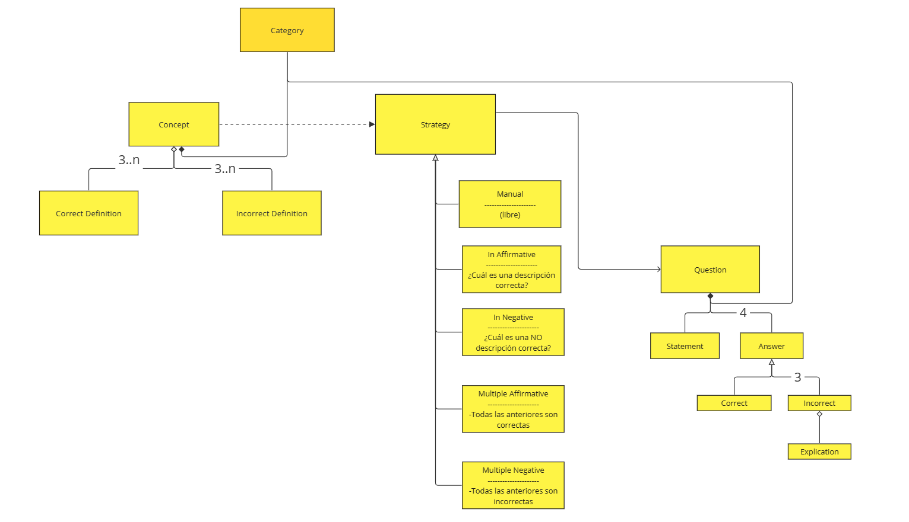

# PROPUESTA DE PROYECTO (borrador)

Se propone una aplicación que servirá de herramienta para recopilar preguntas tipo Test para la autoevaluación de alumnos. Debe contemplar una manera sencilla para recopilar las preguntas de distintas fuentes y ofrecer consejos para facilitar la creación de preguntas en dispositivos móviles.

El usuario podrá componer conjuntos de preguntas en un Test que podrá ejecutar para autoevaluarse, obtener resultados y marcar las preguntas falladas para poder componer otro test de fallos.

Se propone la posibilidad de formar una comunidad de usuarios para compartir estas preguntas, catalogarlas y marcar las revisiones realizadas por usuarios autorizados en la categoría del conocimiento concreto de la pregunta.

<!-- [overview]
 -->

## Dominio

[domain]

## Detalle : Tipos de Estrategias Statement

[domain detail]

## Casos de uso

[useCases]

## Elaboración de una Pregunta

## Referencias

-UML-Quiz: 
Autor: https://vonfranque.com/ (Universidad de Viena)
https://publik.tuwien.ac.at/files/PubDat_237457.pdf

-Webs de test oposiciones

https://www.daypo.com  
http://OpositaTest.com  
http://hacertest.com  
http://Oposito.es  

https://opexams.com/es/ai-quiz-generator/#solution-features

https://testualia.com/test-online-con-inteligencia-artificial/

https://parafrasist.com/creador-de-cuestionarios

https://pregunta2.com/crear

## Decálogo para crear preguntas:
https://www.evolmind.com/blog/como-crear-examen-tipo-test-las-6-herramientas-que-triunfan/

1.Centra cada pregunta del examen en el contenido que realmente es importante.

2.Evita redactar las cuestiones tal cual aparecen en los apuntes de clase. La idea es averiguar si el alumno ha comprendido los conceptos y ciertamente entiende sobre qué se le está preguntando.

3.Elabora preguntas cortas, nada de verborrea ni largas lecturas.

4.Utiliza un lenguaje simple y acorde a tu grupo de alumnos.

5.Cuida la ortografía y gramática. Como sabes, el uso inadecuado de un signo de puntuación o una frase mal construida pueden dar a entender otro significado.

6.Sugiere, de ser posible, tres opciones de respuesta y comprueba que solo una sea la correcta.

7.Formula las preguntas en positivo. De usar negativas, resáltalas con mayúscula y negrita.

8.Cambia el orden en que aparece la respuesta correcta. Por ejemplo, si en la pregunta 1 la respuesta correcta es la ‘A’, en la 2 haz que sea la ‘B’ o la ‘C’.

9.Prescinde de respuestas muy absurdas y ridículas.

10.Aporta un toque de humor si ves que encaja con tu perfil de alumnos.

