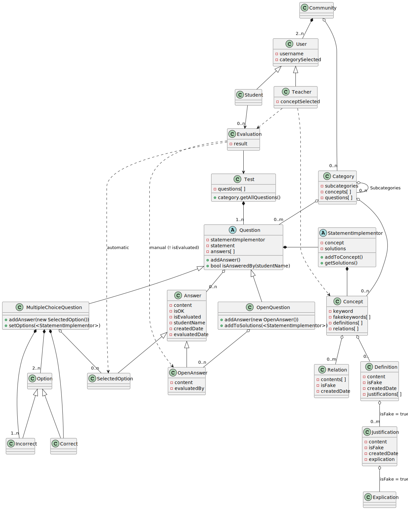

# PROPUESTA DE PROYECTO OPOTEST

Se propone una aplicación que servirá de herramienta para recopilar preguntas tipo Test para la autoevaluación de alumnos. Debe contemplar una manera sencilla para recopilar las preguntas de distintas fuentes y ofrecer consejos para facilitar la creación de preguntas en dispositivos móviles.

El usuario podrá componer conjuntos de preguntas en un Test que podrá ejecutar para autoevaluarse, obtener resultados y marcar las preguntas falladas para poder componer otro test de fallos.

Se propone la posibilidad de formar una comunidad de usuarios para compartir estas preguntas, catalogarlas y marcar las revisiones realizadas por usuarios autorizados en la categoría del conocimiento concreto de la pregunta.

[overview]

[domain]

[references]
UML-Quiz
Autor: https://vonfranque.com/
https://publik.tuwien.ac.at/files/PubDat_237457.pdf
